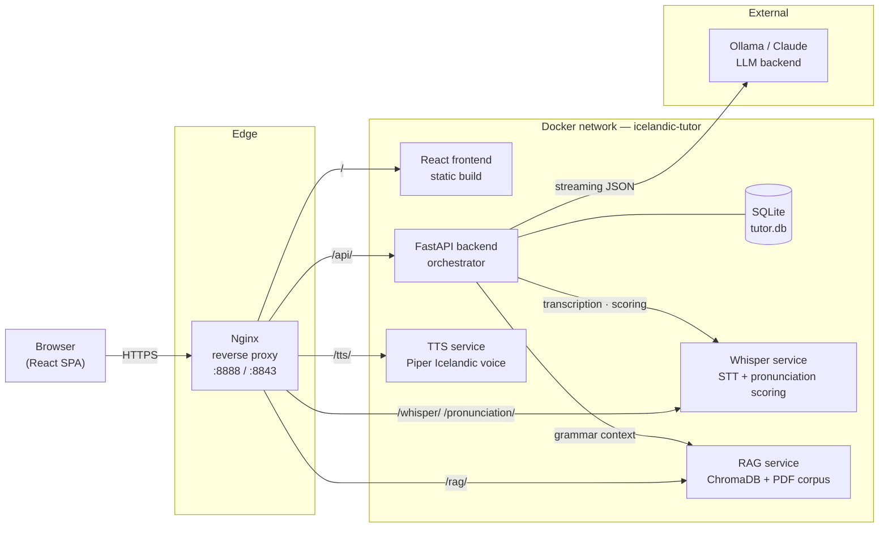

# Architecture

The diagram below shows the six Docker services that make up the tutor, how they are
exposed through the nginx reverse proxy, and where data flows for the primary use
case — a voice chat turn.

## Components

**Nginx reverse proxy** — single entry point for all browser traffic on ports 8888 (HTTP) and 8843 (HTTPS). Routes path prefixes to the appropriate upstream service. Also serves as the TLS terminator; the inner Docker network is plain HTTP.

**React frontend** — compiled static build served by a second nginx instance inside the frontend container. Owns the entire UI: chat, scenarios, lessons, heatmap, progress chart, flashcard review, and CEFR assessment. Communicates exclusively through the nginx prefix routes, so the backend address is never hardcoded.

**FastAPI backend** — the orchestrator. Handles all business logic: building LLM prompts (injecting lesson or scenario context), streaming chat responses, persisting session data, and proxying pronunciation scores. Exposes a `/metrics` Prometheus endpoint and emits OTel traces.

**SQLite database** — single file at `/data/tutor.db`, mounted as a Docker volume. Stores sessions, messages, error log, lesson progress, flashcard deck, pronunciation history, and CEFR assessments. Chosen over a server database because this is a single-user homelab app with no concurrent writers.

**Whisper service** — runs `faster-whisper large-v3-turbo` on the host GPU (RTX 5080). Serves two endpoints that share one loaded model: `/transcribe` for speech-to-text and `/score` for pronunciation assessment. The scoring path re-transcribes audio with word-level timestamps enabled, then aligns expected vs spoken tokens using a string similarity and confidence blend.

**TTS service** — wraps Piper with the `is_IS-bui-medium` Icelandic voice model. Returns raw WAV audio that the browser plays directly. Voice and speed are configurable via environment variable.

**RAG service** — ingests Icelandic grammar PDFs at startup using `intfloat/multilingual-e5-small` embeddings (CPU-only) into ChromaDB. Exposes a `/query` endpoint used by the backend to retrieve the top-3 most relevant chunks before every LLM call.

**Ollama / Claude** — the LLM backend, external to the Docker stack. Switchable at runtime via `LLM_PROVIDER` env var. Both paths receive the same structured prompt and are expected to return the same JSON schema (Icelandic reply, English correction with error categories, new vocabulary, lesson progress).

## Data flow

Primary use case: voice chat turn.

1. User holds the mic button; the browser captures audio as WebM and POSTs it to `/whisper/transcribe`.
2. Whisper transcribes the audio with GPU acceleration and returns the Icelandic transcript.
3. The browser submits the transcript to `/api/chat/stream` (Server-Sent Events).
4. The backend queries the RAG service for grammar context relevant to the conversation.
5. The backend builds a system prompt (with level, mode, scenario or lesson instructions, and RAG context) and opens a streaming request to the LLM.
6. As LLM tokens arrive, the backend scans the buffer for the `"icelandic": "` key and forwards matching characters as SSE `tok` events. The Icelandic sentence appears in the browser incrementally.
7. When the stream closes, the backend parses the full JSON response and writes the session turn, grammar errors (by category), and any new vocabulary to SQLite.
8. The backend emits a final SSE `done` event containing the English correction, vocabulary, and lesson progress fields.
9. Concurrently, the browser POSTs the same audio to `/pronunciation/score`. Whisper re-transcribes with word-level timestamps; per-word scores are shown in the feedback panel.
10. The browser fetches TTS audio from `/tts/synthesize` and auto-plays the Icelandic response.

## Decisions

- **Why SQLite over Postgres:** Single-user homelab app with no concurrent writers and no need to run a separate database server. A volume-mounted file is simpler to back up and migrate.
- **Why a separate Whisper service:** Isolating the GPU workload into its own container keeps model weights resident in VRAM across requests. Both the transcription and pronunciation scoring endpoints share that one loaded model without paying the load cost twice.
- **Why support two LLM backends:** Ollama runs entirely offline on local DGX Spark hardware, which is the normal path. The Claude API option exists for quality comparison and as a fallback, and adding it required only a second implementation of the same streaming interface.
- **Why RAG over relying on the LLM alone:** Icelandic grammar is a narrow domain where LLMs hallucinate plausibly but incorrectly. Grounding explanations in actual grammar PDF text produces corrections that are verifiably sourced rather than confabulated.
