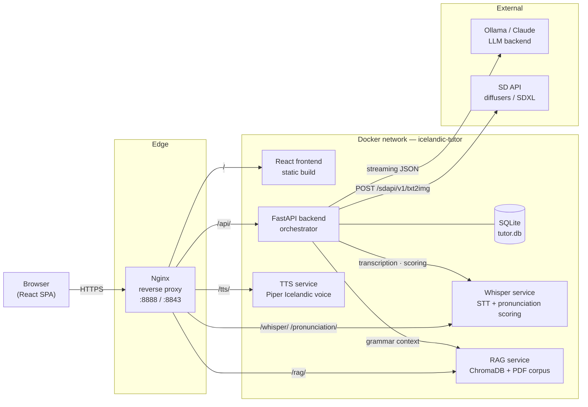

# Architecture

The diagram below shows the six Docker services that make up the tutor, how they are
exposed through the nginx reverse proxy, and where data flows for the primary use
case — a voice chat turn.

```mermaid
flowchart LR
    Browser["Browser\n(React SPA)"]

    subgraph edge["Edge"]
        Nginx["Nginx\nreverse proxy\n:8888 / :8843"]
    end

    subgraph services["Docker network — icelandic-tutor"]
        Frontend["React frontend\nstatic build"]
        Backend["FastAPI backend\norchestrator"]
        DB[("SQLite\ntutor.db")]
        Whisper["Whisper service\nSTT + pronunciation scoring"]
        TTS["TTS service\nPiper Icelandic voice"]
        RAG["RAG service\nChromaDB + PDF corpus"]
    end

    subgraph external["External"]
        LLM["Ollama / Claude\nLLM backend"]
        SDAPI["SD API\ndiffusers / SDXL"]
    end

    Browser -->|HTTPS| Nginx
    Nginx -->|"/"| Frontend
    Nginx -->|"/api/"| Backend
    Nginx -->|"/whisper/ /pronunciation/"| Whisper
    Nginx -->|"/tts/"| TTS
    Nginx -->|"/rag/"| RAG

    Backend -->|grammar context| RAG
    Backend -->|transcription · scoring| Whisper
    Backend -->|streaming JSON| LLM
    Backend -->|"POST /sdapi/v1/txt2img"| SDAPI
    Backend --- DB
```

## Components

**Nginx reverse proxy** — single entry point for all browser traffic on ports 8888 (HTTP) and 8843 (HTTPS). Routes path prefixes to the appropriate upstream service. Also serves as the TLS terminator; the inner Docker network is plain HTTP.

**React frontend** — compiled static build served by a second nginx instance inside the frontend container. Owns the entire UI: chat, scenarios, lessons, heatmap, progress chart, flashcard review, and CEFR assessment. Communicates exclusively through the nginx prefix routes, so the backend address is never hardcoded.

**FastAPI backend** — the orchestrator. Handles all business logic: building LLM prompts (injecting lesson or scenario context), streaming chat responses, persisting session data, and proxying pronunciation scores. Exposes a `/metrics` Prometheus endpoint and emits OTel traces.

**SQLite database** — single file at `/data/tutor.db`, mounted as a Docker volume. Stores sessions, messages, error log, lesson progress, flashcard deck, pronunciation history, and CEFR assessments. Chosen over a server database because this is a single-user homelab app with no concurrent writers.

**Whisper service** — runs `faster-whisper large-v3` on the host GPU (RTX 5080, CUDA 12.9). Serves two endpoints that share one loaded model: `/transcribe` for speech-to-text and `/score` for pronunciation assessment. The scoring path re-transcribes audio with word-level timestamps enabled, then aligns expected vs spoken tokens using a string similarity and confidence blend.

**TTS service** — wraps Piper with the `is_IS-bui-medium` Icelandic voice model. Returns raw WAV audio that the browser plays directly. Voice and speed are configurable via environment variable.

**RAG service** — ingests Icelandic grammar PDFs at startup using `intfloat/multilingual-e5-small` embeddings (CPU-only) into ChromaDB. Exposes a `/query` endpoint used by the backend to retrieve the top-3 most relevant chunks before every LLM call.

**SD API** — external image generation service, called by the backend when creating visual flashcards. The backend POSTs a prompt and generation parameters to `/sdapi/v1/txt2img` and receives a base64-encoded PNG, which it decodes and stores at `/data/images/{card_id}.png` in the `tutor_data` volume. The generated image is then served from `/api/images/{card_id}` through nginx.

The API contract follows the AUTOMATIC1111 WebUI format (`prompt`, `negative_prompt`, `steps`, `width`, `height`, `cfg_scale`), making it compatible with any A1111-compatible server. The bundled implementation (`~/sd-api` on the SD host) wraps the HuggingFace `diffusers` library directly. The recommended model is `stabilityai/stable-diffusion-xl-base-1.0` (SDXL base); parameters are tunable via `SD_STEPS`, `SD_CFG`, `SD_WIDTH`, `SD_HEIGHT` env vars.

An Unsplash fallback is also available (`IMAGE_PROVIDER=unsplash`), which calls the Unsplash random photo endpoint instead and stores the returned CDN URL directly as the `image_url`.

**Ollama / Claude** — the LLM backend, external to the Docker stack. In the primary setup Ollama runs on the same host as the Docker stack (RTX 5080, `host.docker.internal:11434`), serving `mistral-nemo:12b` (fits within the RTX 5080's 16 GB VRAM). Switchable at runtime via `LLM_PROVIDER` env var. Both paths receive the same structured prompt and are expected to return the same JSON schema (Icelandic reply, English correction with error categories, new vocabulary, lesson progress).

## Data flow

Primary use case: voice chat turn.

1. User holds the mic button; the browser captures audio as WebM and POSTs it to `/whisper/transcribe`.
2. Whisper transcribes the audio with GPU acceleration and returns the Icelandic transcript.
3. The browser submits the transcript to `/api/chat/stream` (Server-Sent Events).
4. The backend queries the RAG service for grammar context relevant to the conversation.
5. The backend builds a system prompt (with level, mode, scenario or lesson instructions, and RAG context) and opens a streaming request to the LLM.
6. As LLM tokens arrive, the backend scans the buffer for the `"icelandic": "` key and forwards matching characters as SSE `tok` events. The Icelandic sentence appears in the browser incrementally.
7. As soon as the closing quote of the `icelandic` field is detected, the backend emits a `tts_ready` SSE event containing the fully-assembled Icelandic text. The browser immediately fetches TTS audio from `/tts/synthesize` and begins playback — this fires while the LLM is still generating the remainder of the JSON (corrections, vocabulary, lesson fields).
8. When the LLM stream closes, the backend parses the full JSON response and writes the session turn, grammar errors (by category), and any new vocabulary to SQLite.
9. The backend emits a final SSE `done` event containing the English correction, vocabulary, and lesson progress fields.
10. Concurrently, the browser POSTs the same audio to `/pronunciation/score`. Whisper re-transcribes with word-level timestamps; per-word scores are shown in the feedback panel.

## GPU vs CPU per service

Each service was evaluated for whether GPU acceleration provides a meaningful benefit. With a single GPU shared between Whisper and the LLM, VRAM is a limited resource — assigning it to services that don't need it wastes headroom and adds contention.

| Service       | Device | GPU impact if switched | Rationale |
|---------------|--------|------------------------|-----------|
| Whisper STT   | **GPU** | 🔴 Critical | `large-v3` on CPU takes minutes per request; on GPU it's near real-time. The model stays resident in VRAM across requests to avoid reload cost. |
| LLM (Ollama)  | **GPU** | 🔴 Critical | A 12B parameter model on CPU produces ~3–5 tokens/sec; on GPU it produces ~100-120 tokens/sec. Unusable without GPU. |
| Piper TTS     | CPU    | 🟢 Negligible | Piper synthesises a typical Icelandic sentence in under 100ms on CPU. GPU would save at most a few milliseconds — not perceptible. `use_cuda=False` is intentional. |
| RAG service   | CPU    | 🟡 Minor | `multilingual-e5-small` is a tiny embedding model; a single query embeds in ~10ms on CPU. GPU would cut this to ~2ms — irrelevant against the LLM latency of several seconds. |
| SD API        | **GPU** (external) | 🔴 Critical | SDXL base on CPU takes several minutes per image; on GPU (GB10 DGX Spark) it takes ~10s. The service runs on a separate host and is not part of the main Docker stack. |
| Backend       | CPU    | 🟢 None | Pure I/O-bound orchestration — JSON parsing, SQLite reads, HTTP proxying. No matrix operations. |
| Frontend      | CPU    | 🟢 None | Static file serving via Nginx. |

The RTX 5080 has 16 GB VRAM. `mistral-nemo:12b` at 4-bit quantization uses ~7–8 GB; Whisper `large-v3` uses ~3 GB — leaving ~5 GB headroom. Adding TTS or RAG to the GPU would consume VRAM without any user-perceptible improvement.

## Decisions

- **Why SQLite over Postgres:** Single-user homelab app with no concurrent writers and no need to run a separate database server. A volume-mounted file is simpler to back up and migrate.
- **Why a separate Whisper service:** Isolating the GPU workload into its own container keeps model weights resident in VRAM across requests. Both the transcription and pronunciation scoring endpoints share that one loaded model without paying the load cost twice.
- **Why support two LLM backends:** Ollama runs entirely offline on the local GPU host, which is the normal path. The Claude API option exists for quality comparison and as a fallback, and adding it required only a second implementation of the same streaming interface.
- **Why RAG over relying on the LLM alone:** Icelandic grammar is a narrow domain where LLMs hallucinate plausibly but incorrectly. Grounding explanations in actual grammar PDF text produces corrections that are verifiably sourced rather than confabulated.
- **Why a separate SD API service:** Image generation is GPU-intensive and architecturally unrelated to the language tutor. Keeping it as an external service with a stable A1111-compatible HTTP contract means the model and hardware can be upgraded independently without touching the main stack. The Unsplash fallback provides a zero-GPU path for deployments without a dedicated image generation host.
- **Why SDXL base over SDXL Turbo for flashcard images:** Turbo's adversarial distillation trains out the need for classifier-free guidance, so it requires `cfg_scale` near zero. At `cfg_scale=7` (the standard value for base models) Turbo completely ignores the text prompt and generates from its prior distribution. SDXL base at `cfg_scale=7` and 25 steps reliably produces clean, correctly-subject product-style images on white backgrounds — which is exactly what flashcard review requires.
